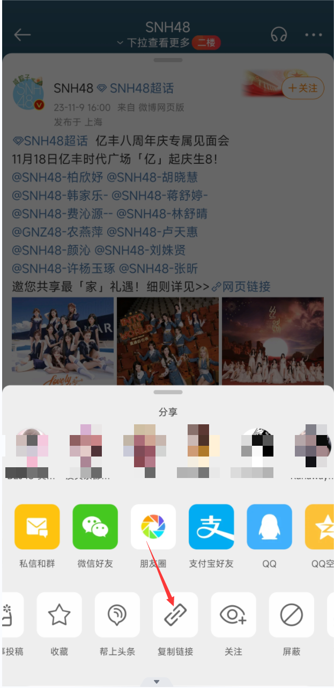
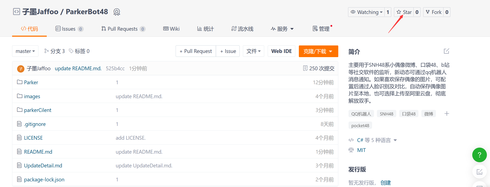

# ParkerBot(爬客机器人)

## [更新日志或计划](https://gitee.com/jaffoo/ParkerBotV2/blob/master/UpdateDetail.md)
## [QQ机器人被风控使用看这](https://gitee.com/jaffoo/ParkerBotV2/blob/master/WindControl.md)

## 更新说明
如果你需要更新，把下载好的包（免安装版）解压，将里面的所有内容替换到现有机器人的根目录，建议先删除除了data和wwwroot以外的所有文件及文件夹，然后在把新的文件粘贴进去。

## 介绍
主要用于SNH48系监听微博、口袋48、b站等偶像社交软件，新动态可通过qq消息通知。如果喜欢保存偶像的图片，可配置后通过人脸识别及对比，自动保存偶像图片至本地，也可选择上传至阿里云盘，彻底解放双手。

## 仓库文件夹结构
-Park，服务端C#。

-parkClien，客户端vue。

-images，此文档的说明图片。

## 软件架构
基于 .NET 6 winform框架开源UI库[NanUI](https://gitee.com/dotnetchina/NanUI)开发。前端使用的是vite，Vue3，Ts，ElementUI。

## 安装教程

1.  下载地址：[夸克云盘](https://pan.quark.cn/s/6d8e3a401056) 提取码：HpaT
2.  不想使用云盘，可以自行编译或者加作者[QQ](https://gitee.com/jaffoo/ParkerBotV2#%E9%97%AE%E9%A2%98%E5%8F%8D%E9%A6%88)
3.  自行编译下载源码编译或打包（推荐使用VS2022）（编译教程:下载代码后找到根目录/wwwroot/other/编译流程.docs或[在线浏览](https://gitee.com/jaffoo/ParkerBotV2/tree/master/Parker/wwwroot/other/编译流程.docx)）。
4.  编译完成（绿色版无需安装），目录找到ParkerBot.exe，运行即可。
5.  仅支持Windows，不支持linux，macos等。推荐在Windows>=10，Windows Server>=2016上使用。

## 主界面更多功能介绍
1. 抓取微博，根据微博ID获取图片，进行识别保存上传。微博ID获取方式如图。打开具体某条微博点击右上角三个点，复制链接，得到链接`https://weibo.com/2689280541/4966195770163347`,最后的`4966195770163347`就是此条微博的ID

2. 开启风控，当qq被风控时使用。具体使用方法查看本文档开头。
3. 关闭远程，风控模式下显示。具体使用方法查看本文档开头。
4. 清空缓存，当发现配置后不正确时使用。

## 配置教程

1.  QQ
- QQ群，后续配置的消息通知默认发送至此处配置的群，可多个，用英文逗号分开。
- 超级管理员，QQ机器人的最高管理员。（向机器人发送#菜单）
- 管理员，顾名思义。（向机器人发送#菜单）
- 启用功能，问答(ChatGPT)。（更多功能开发中！）
- 功能分类，将启用的功能分配给置顶角色。
- 敏感词，和下面敏感词操作配套使用。
- ChatGPT密钥，获取方式，登录/注册[github](https://github.com)，打开[申请密钥](https://github.com/chatanywhere/GPT_API_free)点击【申请内测免费Key或支持付费Key】得到密钥填入即可。注：申请免费key，github注册时间要大于等于7天。
2.  微博
- 主要用户，需要关注的用户ID，通常第一个id是偶像的id才能转发微博动态，后面用户id用于人脸识别保存，获取方式如图：
    
    得到这个链接地址`https://weibo.com/u/689280541`，其中689280541这个数字就是用户id。
- 关注用户，监控动态。
- 微博关键词，填入关键词，当关注用户微博中含有此关键词时，可通过QQ发送消息通知。
- 监听间隔，监听间隔时长，默认3分钟。注：要精确到秒自己换算（不建议时长小于10秒），如半分钟则是0.5分钟，1-3分钟最合适，监听时间过短，可能会导致被限制IP，严重则封IP，从而导致监听失败。
- 转发至qq群，开启后，第一个配置的用户发送了新微博，会通过qq发送消息通知。可单独配置需要通知群，不配置则默认第一项QQ配置中的qq群。注：当监听了多个用户时，只有第一个用户的微博消息会通过qq通知，所以第一个应当配置为需要通过QQ通知的微博用户。
- 转发至qq，和上述转发至群功能大同小异。
3. B站
- 用户ID，需要关注的用户ID，获取方式如图：    
得到连接`https://space.bilibili.com/2832224?share_medium=android&share_source=copy_link&bbid=XU94CF99666A8BB964A01C7379DC4B2AC3F95&ts=1689298684776`找到com/后面的数字2832224就是用户ID。
- 监听间隔，和微博一样，不做赘述。
- 转发至qq群和转发至qq好友和微博一样。
4. 口袋48
- 姓名，小偶像的姓名。
- IMServerId和直播房间Id，点击【查询小偶像】按钮一键查询输入或者打开[小偶像口袋信息](https://fastly.jsdelivr.net/gh/duan602728596/qqtools@main/packages/NIMTest/node/roomId.json)，找到对应小偶像的serverId和liveRoomId后面的数字填入即可。
- IM账号和IMToken，填入自己的账号，不知道的点击【登录口袋48按钮】输入手机号码验证码，可以自动获取完成。
- 转发至qq群和转发至qq好友，可将小偶像口袋房间和直播间发送的消息转发至指定的qq群或好友。
5. 小红书（未测试稳定性，但不会使软件崩溃）
- 具体使用和微博一样，不再说明。
- 获取用户id，打开[小红书网页版](https://www.xiaohongshu.com/)，搜索找到用户，点击用户进入用户主页，地址栏`https://www.xiaohongshu.com/user/profile/616baeb7000000000201df36`中‘profile/’后面的`616baeb7000000000201df36`就是用户id。
6. 抖音（暂未上线）
7. 百度(用于人脸识别)
- appKey和appSeret获取方式，打开[百度云](https://cloud.baidu.com/)右上角登陆，然后进行实名认证，选个人认证，完成后打开[领取免费资源](https://console.bce.baidu.com/ai/#/ai/face/overview/resource/getFree)，按图操作。
    领取成功后点击前往应用列表。点击创建应用，勾选红框中的内容或者按照默认全选也行，然后按照要求填入信息后点击立即创建，首页就可以看到你刚刚创建的应用，把相应的apiKey和SecretKey填入配置相应位置即可。

- 开启人脸验证，顾名思义。
- 基础人脸，上传3张人脸照片，尽量找五官清晰的近期照片。
- 人脸相似度，当人脸相似度大于该值，则直接保存。
- 审核相似度，当人脸相似度大于该值，小于【人脸相似度】时，加入审核列表。可在首页进行审核，如果使用qq机器人，发送#菜单 查看审核功能的使用。
- 上传云盘，目前只支持阿里云盘，后续看需添加其他云盘。
- 相册名称，上传到指定的相册，如果相册不存在，则会创建相册。 
           注：由于阿里云盘上传机制的问题，在文件列表中，也会出现和相册一模一样的文件夹，如果后续占用过大，此文件夹内容可以删除，但是每次新上传图片，都会先上传到此文件夹。

## 启动机器人
启动顺序【启动Mirai机器人】-> 【启动机器人】=【启动阿里云盘】 
注：【启动Mirai机器人】只有在【Mirai配置】中启用机器人，且配置正确才会显示。
    【启动阿里云盘】只有在【修改配置】中启用【百度】【上传云盘】功能才会显示，第一次启动阿里云盘需要扫码，会弹出二维码。

## 特别说明
右键->DevTools，可打开调试控制台可供使用，不懂忽略即可。

## 分支说明
1. master分支，主分支，基于mirai QQ机器人开发。
2. MouseKey分支，不依赖QQ机器人，模拟鼠标键盘发送通知消息。（功能已融合至master分支，暂留，不在维护）

## 参与贡献

1.  Fork 本仓库
2.  新建 Feat_xxx 分支
3.  提交代码
4.  新建 Pull Request

## 如果觉得该项目有用的话可以给我点个star
 

## 问题反馈
1. 此仓库提交[Issue](https://gitee.com/jaffoo/ParkerBotV2/issues)。
2. 加作者qq：1615842006，添加答案：gitee