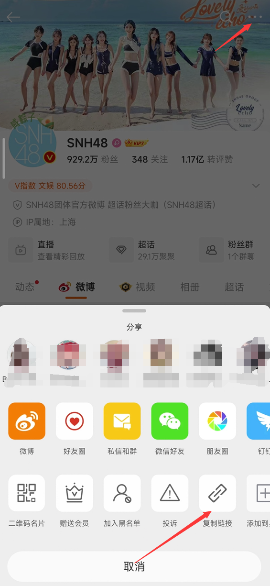
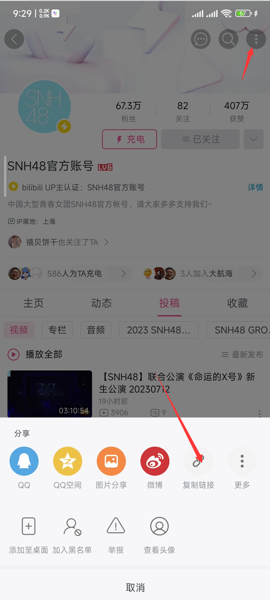
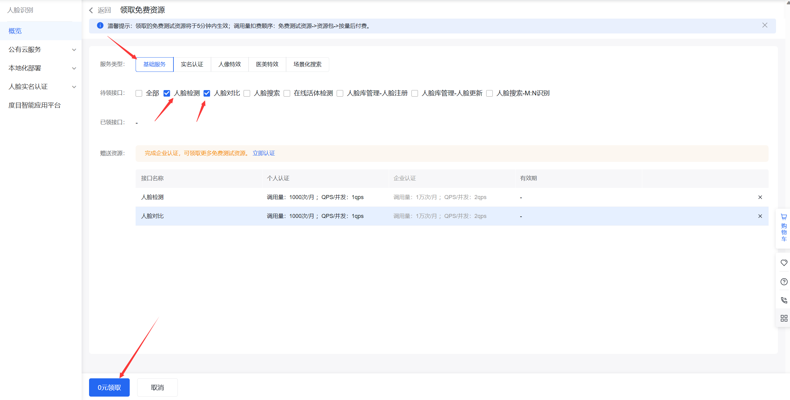
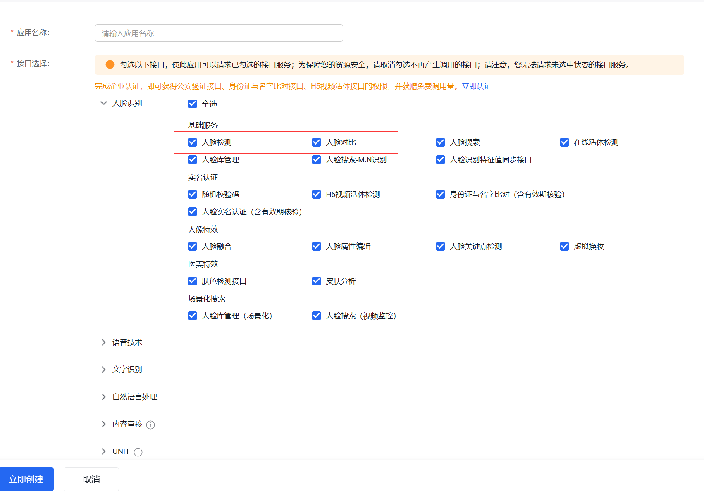
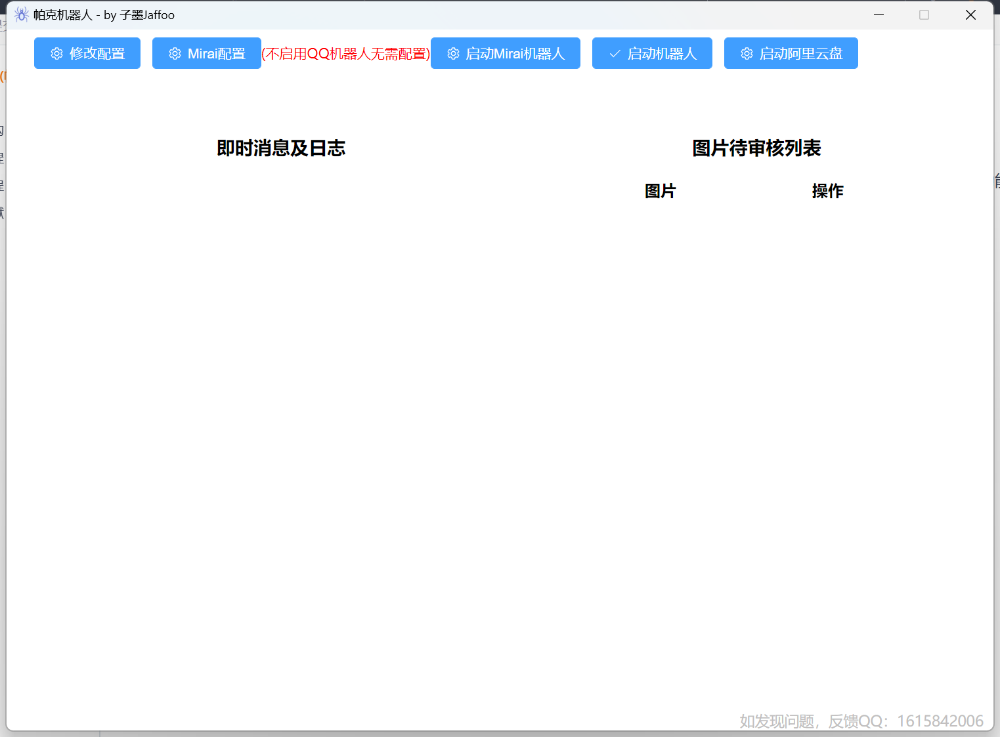

# ParkerBot(爬客机器人)

## 介绍
主要用于SNH48系监听微博、口袋48、b站等偶像社交软件，新动态可通过qq消息通知。如果喜欢保存偶像的图片，可配置后通过人脸识别及对比，自动保存偶像图片至本地，也可选择上传至阿里云盘，彻底解放双手。

## 仓库文件夹结构
-Park，服务端C#。

-parkClien，客户端vue。

-images，此文档的说明图片。

## 软件架构
基于 .NET 6 winform框架开源UI库[NanUI](https://gitee.com/dotnetchina/NanUI)开发。前端使用的是vite，Vue3，Ts，ElementUI。

## 安装教程

1.  由于仓库限制上传文件大小，需要自行下载源码编译。
2.  编译完成（绿色版无需安装），目录找到ParkerBot.exe，运行即可。
注：如不会编译或者需要安装版，加作者[QQ](https://gitee.com/jaffoo/ParkerBotV2/edit/master/README.md#问题反馈)

## 配置教程

1.  QQ
- QQ群，后续配置的消息通知默认发送至此处配置的群，可多个，用英文逗号分开。
- 超级管理员，QQ机器人的最高管理员。（向机器人发送#菜单）
- 管理员，顾名思义。（向机器人发送#菜单）
- 启用功能，闲聊，艾特机器人发送问题；艾特作图，艾特某人加关键词【爬，比心，丢，处对象】；天气查询，艾特机器人发送北京天气；文案搜索，艾特机器人发送xx文案，如青春文案；添狗，艾特机器人发送添狗。（更多功能开发中！）
- 功能分类，将启用的功能分配给置顶角色。
- 敏感词，和下面敏感词操作配套使用。
- ChatGPT密钥，获取方式，登录github并访问[github](https://github.com/chatanywhere/GPT_API_free)点击【申请内测免费Key或支持付费Key】得到密钥填入即可。注：申请免费key，github注册时间要大于等于7天。
2.  微博
- 主要用户，需要关注的用户ID，通常第一个id是偶像的id才能转发微博动态，后面用户id用于人脸识别保存，获取方式如图：
    
    得到这个链接地址`https://weibo.com/u/689280541`，其中689280541这个数字就是用户id。
- 关注用户，监控动态。
- 微博关键词，填入关键词，当关注用户微博中含有此关键词时，可通过QQ发送消息通知。
- 监听间隔，隔过少时间监听一次，默认3分钟。注：要精确到秒自己换算，如半分钟则是0.5分钟，1-3分钟最合适，监听时间过短，可能会导致被限制IP，严重则封IP，从而导致监听失败。
- 转发至qq群，开启后，第一个配置的用户发送了新微博，会通过qq发送消息通知。可单独配置需要通知群，不配置则默认第一项QQ配置中的qq群。注：当监听了多个用户时，只有第一个用户的微博消息会通过qq通知，所以第一个应当配置为需要通过QQ通知的微博用户。
- 转发至qq，和上述转发至群功能大同小异。
3. B站
- 用户ID，需要关注的用户ID，获取方式如图：    
得到连接`https://space.bilibili.com/2832224?share_medium=android&share_source=copy_link&bbid=XU94CF99666A8BB964A01C7379DC4B2AC3F95&ts=1689298684776`找到com/后面的数字2832224就是用户ID。
- 监听间隔，和微博一样，不做赘述。
- 转发至qq群和转发至qq好友和微博一样。
4. 口袋48
- 姓名，小偶像的姓名，如SNH-xxx.
- IMServerId和直播房间Id，点击【查询小偶像】按钮一键查询输入或者打开[小偶像口袋信息](https://fastly.jsdelivr.net/gh/duan602728596/qqtools@main/packages/NIMTest/node/roomId.json)，找到对应小偶像的serverId和liveRoomId后面的数字填入即可。
- IM账号和IMToken，填入自己的账号，不知道的点击【登录口袋48按钮】输入手机号码验证码，可以自动获取完成。
- 转发至qq群和转发至qq好友，可将小偶像口袋房间和直播间发送的消息转发至指定的qq群或好友。
5. 小红书（暂未上线）
6. 抖音（暂未上线）
7. 百度(用于人脸识别)
- appKey和appSeret获取方式，打开[百度云](https://cloud.baidu.com/)右上角登陆，然后进行实名认证，选个人认证，完成后打开[领取免费资源](https://console.bce.baidu.com/ai/#/ai/face/overview/resource/getFree)，按图操作。
    领取成功后点击前往应用列表。点击创建应用，勾选红框中的内容或者按照默认全选也行，然后按照要求填入信息后点击立即创建，首页就可以看到你刚刚创建的应用，把相应的apiKey和SecretKey填入配置相应位置即可。

- 开启人脸验证，顾名思义。
- 基础人脸，上传3张人脸照片，尽量找五官清晰的近期照片。
- 人脸相似度，当人脸相似度大于该值，则直接保存。
- 审核相似度，当人脸相似度大于该值，小于【人脸相似度】时，加入审核列表。可在首页进行审核，如果使用qq机器人，发送#菜单 查看审核功能的使用。
- 上传云盘，目前只支持阿里云盘，后续看需添加其他云盘。
- 相册名称，上传到指定的相册，如果相册不存在，则会创建相册。
           注：由于阿里云盘上传机制的问题，在文件列表中，也会出现和相册一模一样的文件夹，如果后续占用过大，此文件夹内容可以删除，但是每次新上传图片，都会先上传到此文件夹。

## 启动机器人

启动顺序【启动Mirai机器人】-> 【启动机器人】->【启动阿里云盘】
注：【启动Mirai机器人】只有在【Mirai配置】中启用机器人，且配置正确才会显示。
    【启动阿里云盘】只有在【修改配置】中启用【百度】【上传云盘】功能才会显示，第一次启动阿里云盘需要扫码，会弹出二维码。

## 特别说明
右键->DevTools，可打开调试控制台可供使用，不懂忽略即可。

## 分支说明
1. master分支，主分支，基于mirai QQ机器人开发。
2. konata分支，基于C#konata QQ机器人开发（废弃）。
3. MouseKey分支，不依赖QQ机器人，模拟鼠标键盘发送通知消息。（qq被风控时使用）

## 参与贡献

1.  Fork 本仓库
2.  新建 Feat_xxx 分支
3.  提交代码
4.  新建 Pull Request

## 问题反馈
1. 此仓库提交Issue。
2. 加作者qq：1615842006，添加答案：gitee> 这里输入引用文本