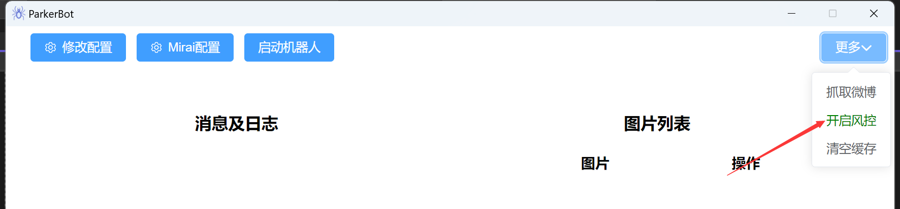
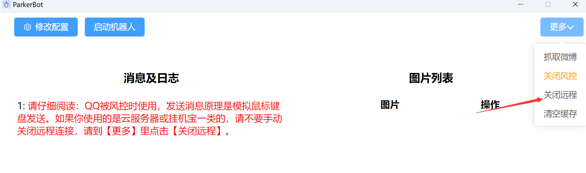

# 风控使用说明
1. 打开风控模式

2. 风控模式下，不在支持mirai配置，以及qq相关配置。
3. 发送消息，通过程序模拟鼠标键盘已到达发送消息的目的，一切配置好后，启动机器人，你需要打开qq聊天窗口，并用鼠标点击消息输入框，显示输入的光标即可发送消息。
4. 注意事项： 
(1).由于是模拟键盘发送，所以输入的鼠标光标需要一直在聊天窗口; 
(2).如果是本机电脑使用，不应该让电脑处于休眠状态，否则发送消息会失效； 
(3).如果是使用的挂机宝或服务器，推荐使用微软自带的远程工具（远程桌面连接），当你开启了发送消息至qq时，如果需要退出远程桌面后还能发送消息，请不要手动去关闭远程连接。使用软件自带的关闭远程连接功能（如下图）。由于进行了其他操作，所以鼠标光标已经不在聊天窗口，故使用关闭远程连接后留了5秒的时间，你需要再次将鼠标光标定位到聊天窗口; 

(4).不支持发送多个群或人; 
(5).如果发现发送消息失败，请检查配置项是否开启了【转发至qq】，以及检查qq聊天窗口的发送快捷键是不是enter键(有些默认是ctrl+enter)，如果不是请改成enter键; 